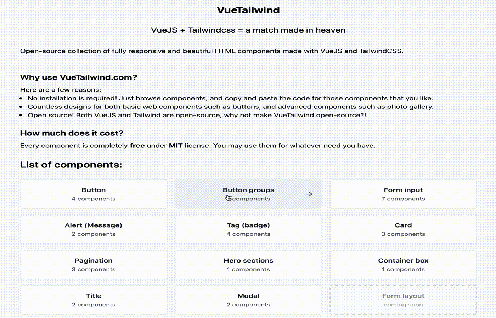

# VueTailwind

Open-source collection of fully responsive and beautiful HTML components made with TailwindCSS and VueJS.

## Why use VueTailwind?

Here are a few reasons:

- No installation required! Just browse components, and copy and paste the code.
- Countless designs for both basic components such as buttons, and advanced components such as photo gallery.
- Open source! Both VueJS and Tailwind are open-source, why not make VueTailwind open-source?!

## How to use?

Just browse components on [VueTailwind](https://vuetailwind.com/) website, and if you see something you like, 
click on "code" to see the code which you can copy. 

Few components require Javascript, in which case you need to have VueJS 2.* installed on your environment.

## Contribution guide

Contribution is highly appreciated. Please:

- Submit only high-quality components (of course "quality" cannot be measured by the number, but try to keep the design of other components on the site)
- Avoid submitting components that are almost the same as the existing ones, but merely SLIGHTLY different. Remember that the more the 
number of items on the project is, the harder it is to maintain.
- It is a very good idea to open an issue about your intended design and discuss it. 
